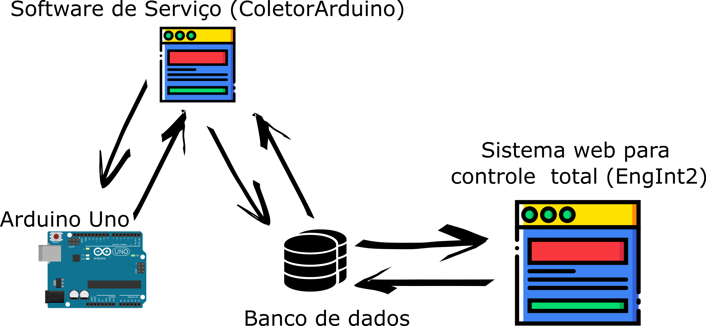
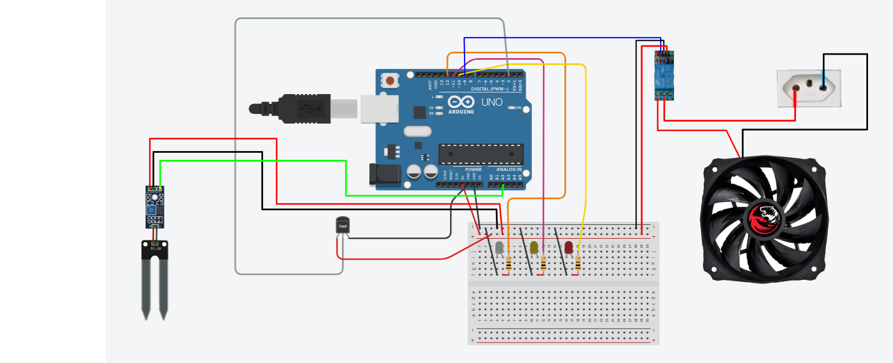

# Unisinos - Engenharia Integrada 2
Projeto da disciplina de Engenharia Integrada II: Automação e Robótica, do curso de Engenharia Mecânica da Universidade do Vale dos Sinos.

 A proposta da disciplina é desenvolver uma solução envolvendo automação, aplicando os conhecimentos adquiridos até o momento no curso de engenharia mecânica. A solução proposta é uma estufa automatizada de cultivo indoor de hortaliças. Neste diretório, estarão contidos apenas a parte do projeto relativo aos softwares e ao hardware. As demais outras partes, como:
 
* #### Projeto térmico 
* #### Projeto de irrigação

 Não estarão contidos aqui.
 
 ## Como funciona?
 
 Abaixo está uma imagem mostrando o funcionamento básico do sistema de controle da estufa:
 
 
 
 ## Arduino Uno.
 O Arduino será responsável por hospedar todos os sensores e componentes de acionamento dos sistemas de irrigação, iluminação, ventilação e exaustão. Além disso, o seu microprocessador irá executar um programa que coleta os dados dos sensores e os envia para uma porta de comunicação serial. Através desta mesma porta serial, o programa também insere dados de entrada, fazendo com que os sistemas já citados, sejam acionados de forma individual. Como o Arduino dispõe de um cabo USB para comunicação por hardware, esse cabo é conectado em um computador, fazendo a comunicação entre ambos. Abaixo está o desenho do projeto de hardware do Arduino:
 
 
 
 Para fins de protótipo, ao invés de um sistema de exaustão, foi instalado um LED branco, que quando acionado, representa um relé que controla um pequeno exaustor bivolt, com especificações aproximadas de: 
 
 * 150mm de diâmetro
 * 18W de potência
 * Vazão de 160m³/h
 
 Da mesma forma, o sistema de irrigação será representado pelo LED amarelo. Quando o LED estiver aceso, representa o acionamento do relé que controla uma válvula solenóide que permite, ou não, a passagem da água para a irrigação das plantas.
 
 O LED vermelho representa o sistema de iluminação, que numa aplicação real, seria o relé de acionamento de um painel de LEDs com cerca de 1500W de potência.
 
 E por fim, uma ventoinha representa os ventiladores que serão acionados caso uma determinada temperatura for atingida, fazendo duas funções, simultaneamente: 
 
 * Troca de temperatura por convexão forçada
 * Auxilio no movimento e troca de ar dentro da estufa com o ambiente, melhorando a oxigenação, que é essencial para as plantas cultivadas.
  
 O programa desenvolvido no Arduino, está disponível [aqui](https://github.com/ricardovws/Unisinos-EngenhariaIntegrada2/blob/master/CodigoArduino/CodigoArduino.ino).
 
 ## Software de Serviço (ColetorArduino).
 DIvagações.

## Sistema web para controle total (EngInt2).
 DIvagações.
