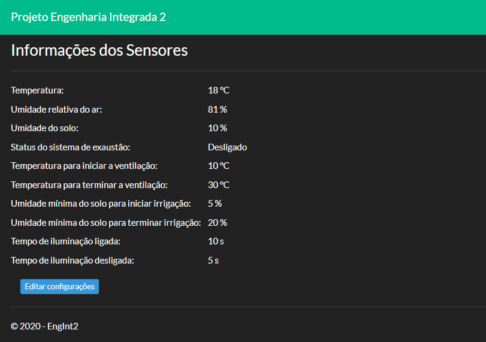

# Unisinos - Engenharia Integrada 2
Projeto da disciplina de Engenharia Integrada II: Automação e Robótica, do curso de Engenharia Mecânica da Universidade do Vale dos Sinos.

 A proposta da disciplina é desenvolver uma solução envolvendo automação, aplicando os conhecimentos adquiridos até o momento no curso de engenharia mecânica. A solução proposta é uma estufa automatizada de cultivo indoor de hortaliças. Neste diretório, estarão contidos apenas a parte do projeto relativo ao controle e automação, como os softwares e o hardware. As demais outras partes, como:
 
* #### Projeto térmico 
* #### Projeto de irrigação
* #### Projeto de ventilação
* #### Projeto de exaustão
* #### Projeto de iluminação

 Não estarão contidos aqui.
 
 ## Como funciona?
 
 Abaixo está uma imagem mostrando o funcionamento básico do sistema de controle da estufa:
 
 
 
 ## Arduino Uno
 O Arduino será responsável por hospedar todos os sensores e componentes de acionamento dos sistemas de irrigação, iluminação, ventilação e exaustão. Além disso, o seu microprocessador irá executar um programa que coleta os dados dos sensores e os envia para uma porta de comunicação serial. Através desta mesma porta serial, o programa também recebe dados de entrada, fazendo com que os sistemas já citados, sejam acionados de forma individual. Como o Arduino dispõe de um cabo USB para comunicação por hardware, esse cabo é conectado em um computador, fazendo a comunicação entre ambos. Abaixo está o desenho do projeto de hardware do Arduino:
 
 
 
 //inserir legenda
 
 Para fins de protótipo, ao invés de um sistema de exaustão, foi instalado um LED branco, que quando acionado, representa um relé que controla um pequeno exaustor bivolt, com especificações aproximadas de: 
 
 * 150mm de diâmetro
 * 18W de potência
 * Vazão de 160m³/h
 
 Da mesma forma, o sistema de irrigação será representado pelo LED amarelo. Quando o LED estiver aceso, representa o acionamento do relé que controla uma válvula solenóide que permite, ou não, a passagem da água para a irrigação das plantas.
 
 O LED vermelho representa o sistema de iluminação, que numa aplicação real, seria o relé de acionamento de um painel de LEDs com cerca de 1500W de potência.
 
 E por fim, uma ventoinha representa os ventiladores que serão acionados caso uma determinada temperatura for atingida, fazendo duas funções, simultaneamente: 
 
 * Troca de temperatura por convexão forçada
 * Auxilio no movimento e troca de ar dentro da estufa (volume útil aproximado de 1m³) com o ambiente, melhorando a oxigenação, que é essencial para as plantas cultivadas.
  
 O programa desenvolvido no Arduino, está disponível [aqui](https://github.com/ricardovws/Unisinos-EngenhariaIntegrada2/blob/master/CodigoArduino/CodigoArduino.ino).
 
 ## Software de Serviço (ColetorArduino)
 Esse sistema é uma aplicação console desenvolvida em C# que se comporta como um serviço do windows. A aplicação se executa automaticamente em um intervalo pré-definido de tempo, abrindo uma conexão com a porta serial do Arduino, recebendo e enviando informações para ela. As informações vindas da porta serial, são tratadas e salvas no banco de dados. Quais informações? Todas que são lidas pelos sensores. São elas: Temperatura ambiente, umidade relativa do ar e umidade do solo. A aplicação também envia comandos de consulta ao banco de dados, lendo os dados de status de cada sistema. Os status são coletados do banco de dados, e logo após, tratados e enviados para a porta serial do Arduino. Assim, ocorre o controle do Arduino via banco de dados utilizando o software de serviço.

O código do software de serviço pode ser visto [aqui](https://github.com/ricardovws/Unisinos-EngenhariaIntegrada2/tree/master/ColetorArduino).

 ## Banco de dados 
 No banco de dados são salvos os dados oriundos da porta serial do Arduino, através do ColetorArduino. O mesmo, faz consultas no banco de dados, de modo a inserir informações na mesma porta serial, possibilitando a comunicação com o Arduino. Os dados que o software de serviço consulta, são salvos pelo sistema web (EngInt2) no banco de dados.
 
 ## Sistema web para controle total (EngInt2)
 O sistema EngInt2 faz consultas no banco de dados, mostrando ao usuário informações obtidas pelos sensores:bla, bla, bla, bla.
 Informações de configuração sobre a automação da estufa, que são: bla, bla, bla, são configuradas pelo usuário, através de uma página de confugurações que é habilitada ao clicar no botão "mostrar configurações". E logo após isso, são salvas no banco de dados.
 
 Página inicial:
 
 
 
 Página com edição de configurações habilitada:
 
 
 
 A lógica que determina o tempo de ligado/desligado do sistema de iluminação, momento para ativar ou desativar o sistema de irrigação e ventilação, e acionar ou não o sistema de exaustão, está toda contida no código do EngInt2, que pode ser encontrado [aqui](https://github.com/ricardovws/Unisinos-EngenhariaIntegrada2/tree/master/EngInt2). 
 
 O sistema web salva no banco de dados o status de acionamento de cada sistema de forma individual. Assim, o status é lido pelo software de serviço, e enviado a portal serial do Arduino. O programa do Arduino recebe a informação e, muda o status do relé de acionamento de cada componente.
 Este sistema web MVC foi desenvolvido na plataforma ASP.NET Core, utilizando Entity Framework para tratar com o banco de dados MySQL.
 
 
